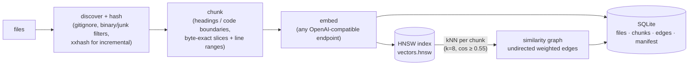
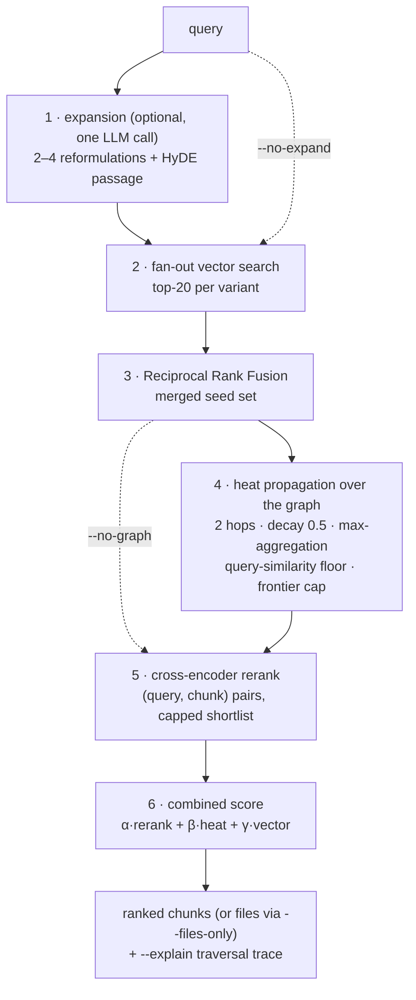
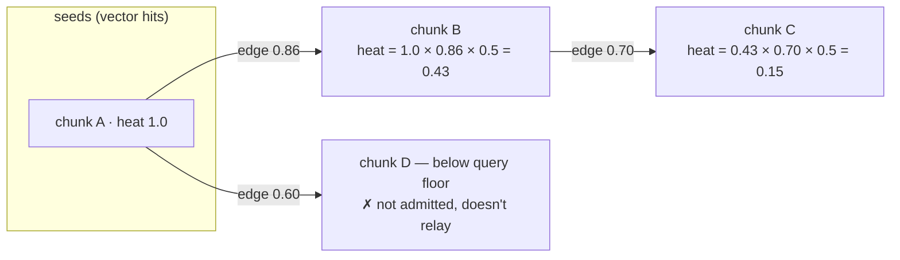

# ragx — similarity-graph RAG for your files

`ragx` indexes a corpus of files into a **chunk-level embedding similarity graph** and answers
queries by combining vector search, **graph traversal**, and **cross-encoder reranking** — all
from a single local CLI. Indexing needs **no LLM** (only an embedding model); an LLM is used
optionally at query time, for query expansion.

**The goal:** local semantic search that finds documents *plain vector search misses*, stays
cheap to (re)index, and is built to be driven by coding agents as much as by humans — stable
JSON schemas, deterministic exit codes, byte-exact source locations, and an `--explain` mode
that can justify every result via the exact graph path that produced it.

```bash
ragx init                      # create .ragx/ with config.toml next to your corpus
ragx index                     # chunk -> embed -> HNSW + kNN similarity graph
ragx query "why did we switch build tools?" --json --files-only
ragx index --changed           # incremental: only new/modified/deleted files
```

Runs against any OpenAI-compatible embedding endpoint (LM Studio, Ollama, OpenAI). Reranking
uses a local sentence-transformers cross-encoder (`ragx[rerank]` extra). Everything lives in a
`.ragx/` directory beside your files — like `.git/`, delete it and the corpus is untouched.

---

## How it works

### Indexing (LLM-free)

Files are chunked structure-aware (markdown headings / code boundaries / recursive fallback),
embedded, and stored in an HNSW index. The similarity graph then falls out almost for free:
one kNN pass over the vectors that are already in memory — each chunk gets edges to its top-k
nearest neighbors above a similarity floor.



Incremental runs (`--changed`) re-embed only changed files and repair only the edge lists that
those chunks touch. Content hashes make `touch`-ed but unchanged files free.

### Querying

Every stage is individually skippable (`--no-expand`, `--no-graph`, `--no-rerank`) so callers
can trade quality for latency.



**Heat propagation** is what sets ragx apart from plain RAG: seed chunks (from vector search)
push "heat" along similarity edges — `heat × edge_weight × decay` per hop. A neighbor's heat is
the **max** of incoming contributions (not the sum, so hub chunks can't inflate themselves), and
a neighbor is only admitted if it's similar enough to the *original query* — traversal stays
anchored to the question instead of drifting through the corpus.



Because every admitted chunk records which seed and edge produced it, `--explain` can print the
full justification: *seed → edge(weight) → chunk*, per result.

---

## Does it actually help? (benchmarks)

Measured with the built-in harness (`ragx eval queries.jsonl`) on a real personal-notes corpus:
**636 markdown files → 1,323 chunks → 5,246 edges**, 18 labeled queries (English + Dutch),
embeddings `nomic-embed-text-v1.5` via LM Studio, reranker `BAAI/bge-reranker-v2-m3`.

| config | recall@5 | recall@10 | MRR |
|---|---:|---:|---:|
| `baseline` — vector search only | 0.833 | 0.833 | 0.593 |
| `graph` — + heat propagation | 0.778 | 0.833 | 0.522 |
| `rerank` — graph + cross-encoder | 0.759 | **0.889** | 0.568 |
| `full` — + LLM expansion | 0.759 | **0.889** | **0.613** |

The recall win is exactly the designed mechanism, and it's traceable. For one Dutch query
("zonnepanelen offerte en terugverdientijd"), the relevant document is **never retrieved** by
vector search — and a reranker alone can't help, because you can't rerank what retrieval never
surfaced:

| pipeline | rank of the relevant file |
|---|---:|
| vector search only | *not found* |
| rerank **without** graph | *not found* |
| graph only | 19 |
| graph **+** rerank | **4** |

The graph surfaced it through a single hop-1 edge (weight 0.86) from a seed chunk, and the
cross-encoder promoted it — *graph expands recall, rerank recovers precision*. The `--explain`
output for that result shows the exact seed → edge → chunk path.

**Honest caveat:** graph traversal *alone* hurts precision on this corpus (MRR 0.593 → 0.522) —
near-duplicate neighbors (e.g. adjacent meeting notes) displace weaker direct hits. A parameter
sweep over decay/floor/weights plateaued below baseline MRR, so this is a property of
similarity-only edges, not a tuning miss. Conclusion baked into the defaults: **graph and
rerank ship together**. Use `--no-graph --no-rerank` as the explicit fast mode.

---

## Agent-first conventions

- `--json` emits exactly one JSON document on stdout (versioned schemas: `ragx.query.v1`,
  `ragx.files.v1`, `ragx.status.v1`, `ragx.eval.v1`, `ragx.inspect.*.v1`); logs go to stderr.
- Exit codes: `0` results, `1` success-but-empty, `2` error.
- Every chunk carries `file`, `line_start/line_end`, `byte_start/byte_end` — agents jump to the
  exact source location and read the full text themselves (JSON chunk text is truncated).
- `--files-only` aggregates chunk scores per file (sum of top-3) — the mode coding agents use most.
- `ragx query -` reads the query from stdin; `ragx inspect chunk|file|neighbors` debugs the graph.

## Configuration

`.ragx/config.toml`, managed via `ragx config get|set`. Key defaults:

| section | defaults |
|---|---|
| `[chunking]` | `size_tokens=800`, `overlap=0.15` |
| `[graph]` | `k=8`, `min_edge_sim=0.55` |
| `[traversal]` | `hops=2`, `decay=0.5`, `query_floor=0.35`, `max_frontier=150` |
| `[fusion]` | `rrf_k=60`, `per_query_top=20` |
| `[scoring]` | `alpha_rerank=0.6`, `beta_heat=0.25`, `gamma_vector=0.15` |
| `[embeddings]` | `provider="openai"`, `base_url="http://localhost:1234/v1"`, prefixes for nomic-style models |
| `[expansion]` | optional LLM for multi-query/HyDE; reasoning models supported (4096-token budget) |
| `[rerank]` | `BAAI/bge-reranker-v2-m3` via sentence-transformers (`pip install 'ragx[rerank]'`) |

## Status

Built and validated through Phase 3 of [the implementation plan](ragx-cli-plan.md):
skeleton → baseline vector RAG → similarity graph → expansion/rerank/eval. Deferred by design:
Leiden community detection (`--global` corpus questions), an MCP server (the core/CLI split it
needs is already enforced), and [temporal weighting](docs/feature-temporal-weighting.md)
(opt-in `--since`/`--until`/`--temporal`, date cascade filename → git → mtime).

Development: `uv sync --group dev && uv run pytest`. 120 tests; module contracts live in
`CONTRACTS.md` / `CONTRACTS-PHASE23.md`.
