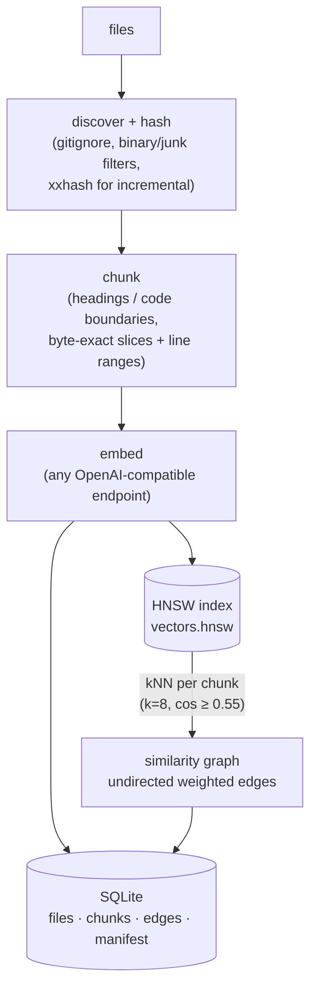
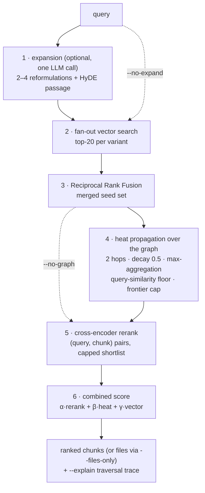
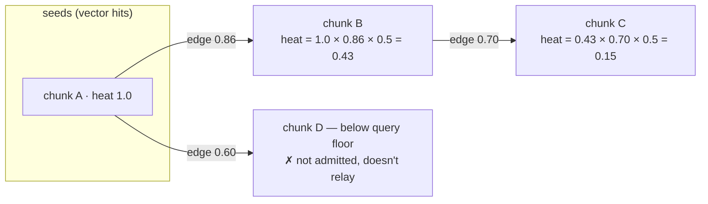

# ragx-cli — similarity-graph RAG for your files

`ragx-cli` indexes a corpus of files into a **chunk-level embedding similarity graph** and answers
queries by combining vector search, **graph traversal**, and **cross-encoder reranking** — all
from a single local CLI. Indexing needs **no LLM** (only an embedding model); an LLM is used
optionally at query time, for query expansion.

It works on any directory of text: pair it with a
[Karpathy-style LLM Wiki](https://gist.github.com/karpathy/442a6bf555914893e9891c11519de94f),
an OpenWiki instance, an Obsidian-style notes vault, or any other knowledgebase repository or
arbitrary docs/code tree — `ragx-cli init` drops a `ragx.toml` next to the files and
everything else stays untouched. LLM-maintained wikis and ragx-cli are complementary: the wiki
distills knowledge into curated pages, while ragx-cli gives agents fast graph-backed retrieval
over those pages (and the raw sources beside them) without re-reading everything per question.

**The goal:** local semantic search that finds documents *plain vector search misses*, stays
cheap to (re)index, and is built to be driven by coding agents as much as by humans — stable
JSON schemas, deterministic exit codes, byte-exact source locations, and an `--explain` mode
that can justify every result via the exact graph path that produced it.

```bash
uv tool install ragx-cli --with ragx-cli[rerank]  # install and use `ragx-cli`
ragx-cli init                  # create ragx.toml next to your corpus (interactive on a TTY; --yes for defaults)
ragx-cli index                 # chunk -> embed -> HNSW + kNN similarity graph
ragx-cli query "why did we switch build tools?" --json --files-only
ragx-cli index --changed       # incremental: only new/modified/deleted files
```

Runs against any OpenAI-compatible embedding endpoint (LM Studio, Ollama, OpenAI). Reranking
uses a local sentence-transformers cross-encoder (`ragx-cli[rerank]` extra). Config lives in
`ragx.toml` at the corpus root (commit it); all index data lives in a `.ragx/` directory beside
your files (gitignore it) — like `.git/`, delete `.ragx/` and the corpus is untouched.

---

- [ragx-cli — similarity-graph RAG for your files](#ragx-cli--similarity-graph-rag-for-your-files)
  - [How it works](#how-it-works)
    - [Indexing (LLM-free)](#indexing-llm-free)
    - [Querying](#querying)
  - [Does it actually help? (benchmarks)](#does-it-actually-help-benchmarks)
    - [Parameter study: what each knob actually does (2026-07)](#parameter-study-what-each-knob-actually-does-2026-07)
    - [BGE-M3 embedding study (2026-07-12)](#bge-m3-embedding-study-2026-07-12)
  - [Agent-first conventions](#agent-first-conventions)
  - [Using ragx-cli from a coding agent (CLAUDE.md / AGENTS.md)](#using-ragx-cli-from-a-coding-agent-claudemd--agentsmd)
    - [Pointing ragx-cli at your LLM — local or online](#pointing-ragx-cli-at-your-llm--local-or-online)
    - [Machine-level settings: `~/.ragxrc`](#machine-level-settings-ragxrc)
  - [Configuration](#configuration)
  - [Features \& roadmap](#features--roadmap)


## How it works

### Indexing (LLM-free)

Files are chunked structure-aware (markdown headings / code boundaries / recursive fallback),
embedded, and stored in an HNSW index. The similarity graph then falls out almost for free:
one kNN pass over the vectors that are already in memory — each chunk gets edges to its top-k
nearest neighbors above a similarity floor.

Experimental: `graph.edge_source = "subchunk"` derives edge weights from sentence-aligned
**sub-chunks** instead of whole-chunk cosine — each chunk is split into ~`subchunk_size_tokens`
windows, embedded separately (stored in SQLite, never in the query-time HNSW), and the edge
weight between two chunks becomes the *max* similarity over their sub-chunk pairs, so a chunk
mixing several concepts gets one sharp edge per concept instead of a diluted average. Edges
between near-duplicate chunks (whole-chunk cosine ≥ `near_dup_sim`) are dropped — those are the
measured precision-killers. Costs roughly 5–10× more embedding calls at index time; retrieval
units, traversal, and query flow are unchanged. Switching `edge_source` (or the sub-chunk size)
requires a full re-index; `--changed` fails loud on the mismatch. Literature grounding:
`research/fine-grained-sub-chunk-edges-with-coarse-chunk-nodes-multi-granularity-graph-rag-literature-validation.md`.
In this mode `k` counts links per *sub-chunk* with no per-chunk cap, so the graph is denser and
shallower traversal suffices. Measured on the tuned eval corpus (2026-07): at `hops=2` it ties
the chunk-edge baseline exactly (same recall, same MRR) at ~4.5× the indexing cost — that
corpus's short, single-topic chunks leave no concept-dilution headroom to exploit. Worth trying
only on corpora with long, genuinely multi-concept chunks (use `hops=2`); the default stays `"chunk"`.

After edge construction, a Leiden partition (`graspologic-native`, seeded, deterministic) is
computed over the whole edge list every index run and stored read-only — see
[`[communities]`](#configuration) and `inspect communities`/`inspect community`.



Incremental runs (`--changed`) re-embed only changed files and repair only the edge lists that
those chunks touch. Content hashes make `touch`-ed but unchanged files free.

### Querying

Every stage is individually skippable (`--no-expand`, `--no-graph`, `--no-rerank`) so callers
can trade quality for latency.



**Heat propagation** is what sets ragx-cli apart from plain RAG: seed chunks (from vector search)
push "heat" along similarity edges — `heat × edge_weight × decay` per hop. A neighbor's heat is
the **max** of incoming contributions (not the sum, so hub chunks can't inflate themselves), and
a neighbor is only admitted if it's similar enough to the *original query* — traversal stays
anchored to the question instead of drifting through the corpus.



Because every admitted chunk records which seed and edge produced it, `--explain` can print the
full justification: *seed → edge(weight) → chunk*, per result.

---

## Does it actually help? (benchmarks)

Measured with the built-in harness (`ragx-cli eval queries.jsonl`) on a real, decade-spanning
personal wiki — organic notes, not a synthetic benchmark. Corpus provenance:

| | |
|---|---|
| **corpus** | 636 markdown files indexed (644 on disk; 8 auto-excluded as `node_modules`/hidden) · 2.9 MB · avg 4.6 KB/file |
| **structure** | topical top-level dirs (`clients/`, `projects/`, `workstreams/`, `personal/`, …), nested up to 10 levels deep |
| **content** | mixed **English + Dutch**: meeting/daily notes, research docs, transcripts, reference material |
| **chunks** | 1,323 (avg 2.1 per file, 452 files are single-chunk; median 2,390 chars ≈ 600 tokens, max 4,888) |
| **graph** | 5,246 edges · avg degree 7.9 (k=8 cap) · weights 0.59–1.00 above the 0.55 floor · only 3 isolated chunks |
| **index** | 5.1 MB SQLite + 4.1 MB HNSW (768-dim `nomic-embed-text-v1.5` via LM Studio) · full build ≈ 2 min on an M-series laptop |
| **labels** | 18 queries (EN + NL) with known-relevant files, single- and multi-target (`.ragx/queries.jsonl`) |

Reranker: `BAAI/bge-reranker-v2-m3` (local cross-encoder). Results:

| config                           | recall@5 | recall@10 |       MRR |
| -------------------------------- | -------: | --------: | --------: |
| `baseline` — vector search only  |    0.833 |     0.833 |     0.593 |
| `graph` — + heat propagation     |    0.778 |     0.833 |     0.522 |
| `rerank` — graph + cross-encoder |    0.759 | **0.889** |     0.568 |
| `full` — + LLM expansion         |    0.759 | **0.889** | **0.613** |

The recall win is exactly the designed mechanism, and it's traceable. For one Dutch query
("zonnepanelen offerte en terugverdientijd"), the relevant document is **never retrieved** by
vector search — and a reranker alone can't help, because you can't rerank what retrieval never
surfaced:

| pipeline                 | rank of the relevant file |
| ------------------------ | ------------------------: |
| vector search only       |               *not found* |
| rerank **without** graph |               *not found* |
| graph only               |                        19 |
| graph **+** rerank       |                     **4** |

The graph surfaced it through a single hop-1 edge (weight 0.86) from a seed chunk, and the
cross-encoder promoted it — *graph expands recall, rerank recovers precision*. The `--explain`
output for that result shows the exact seed → edge → chunk path.

**Honest caveat:** graph traversal *alone* hurts precision on this corpus (MRR 0.593 → 0.522) —
near-duplicate neighbors (e.g. adjacent meeting notes) displace weaker direct hits. A parameter
sweep over decay/floor/weights plateaued below baseline MRR, so this is a property of
similarity-only edges, not a tuning miss. Conclusion baked into the defaults: **graph and
rerank ship together**. Use `--no-graph --no-rerank` as the explicit fast mode.

The parameter study below explains the mechanism behind this caveat — and shows that once the
scoring weights stop putting heat into the final score, the graph win gets much bigger.

### Parameter study: what each knob actually does (2026-07)

A follow-up study swept every traversal, scoring, and graph-build parameter to map sensitivity
and find better settings. Setup: a scoped subset of the same wiki (`clients/` + `workstreams/`:
383 files → 720 chunks → 2,848 edges) with a fresh 26-query EN+NL label set.

**Process.** Sweeping through real `eval` runs costs ~9 minutes each, so the study used an
offline harness (`.lab/harness.py`): one retrieval pass per query plus a text-keyed cross-encoder
score cache lets any traversal × scoring × edge-filter combination be re-evaluated in seconds —
the combination step is deterministic post-processing, and rerank scores depend only on
(query, chunk text). The harness was validated **digit-exact** against the real pipeline before
use, ~125 configurations were measured in staged rounds (scoring simplex → refinement →
traversal one-factor-at-a-time → interaction grid → edge-filter simulations), the winning config
was re-verified with a real `eval` run (again digit-exact), and finally replicated on an
independently rebuilt index.

**Result** — same-index comparisons, `rerank` config (no expansion) unless noted:

| config | MRR | recall@5 | recall@10 |
|---|---:|---:|---:|
| defaults (`hops=2`, α/β/γ = .6/.25/.15) | 0.665 | 0.885 | 0.923 |
| **tuned (`hops=3`, α/β/γ = .9/0/.1)** | **0.755** | 0.885 | **0.962** |

The +13.7% MRR delta replicated as +14.5% on an independently rebuilt index (absolute numbers
differ per build — see the measurement caveat below).

Apply the tuned settings to a corpus with:

```bash
ragx-cli config set traversal.hops 3
ragx-cli config set scoring.alpha_rerank 0.9
ragx-cli config set scoring.beta_heat 0.0
ragx-cli config set scoring.gamma_vector 0.1
```

**Discoveries**, in decreasing order of impact:

- **α (rerank weight) is the dominant knob.** MRR rises monotonically from α=.6 to a plateau at
  α≈.85–.9 (+9% relative), with recall flat across the whole range. Heat belongs at **β=0**:
  once the cross-encoder is trusted, heat in the final score only adds near-duplicate noise —
  which is exactly why the earlier graph-only sweeps plateaued.
- **But never α=1.0.** With β=γ=0 the pre-rerank shortlist selector degenerates (it renormalizes
  β:γ, so every pre-score becomes 0) and MRR collapses to 0.32. Vector + heat pick *which* 100
  candidates the cross-encoder sees at all — they are load-bearing for shortlist selection even
  at near-zero final weight. Keep γ > 0.
- **`hops=3` is the second win, but only after fixing the scoring.** Under default weights,
  traversal depth is completely inert (heat dilution cancels the candidate gains); under
  rerank-heavy weights it adds both MRR and recall@10. **`hops=4` degrades**: ~570 candidates
  overwhelm the fixed rerank shortlist (`RERANK_CAP=100`) and good candidates get evicted before
  the cross-encoder ever sees them — the cap, not the graph, becomes the binding constraint.
- **Graph = recall channel, cross-encoder = precision channel.** At identical tuned scoring,
  removing the graph keeps MRR (0.71) but drops recall@10 by 7.7 points. The graph's job is to
  put reachable targets in front of the reranker; the reranker's job is to rank them.
- **Everything else is inert or already optimal**: `decay` (.3–.7), `query_floor` (.2–.5),
  `max_frontier` (50–300), and `min_edge_sim` (up to .7) don't move metrics; `k=8` is bracketed
  optimal from both sides (k=4/6 lose recall, a real k=12 rebuild was no better).
- **LLM expansion buys recall, not ranking.** The full pipeline at default params reached the
  same recall@10 that `hops=3` provides for free, at ~40 s/query for a local reasoning model.
  On tuned params expansion still stacked (+.03 MRR) — worth it only when latency doesn't matter.
- **Measurement caveat: index rebuilds are not reproducible across embedding-server sessions.**
  Rebuilding is deterministic within a session, but embeddings drift between LM Studio sessions
  (~.04 MRR at identical params). Compare configs on the same build only; the tuned-vs-default
  delta replicated across two independent builds (+13.7% / +14.5% MRR).

### BGE-M3 embedding study (2026-07-12)

A follow-up study asked whether switching the embedding model beats tuning parameters on top of
the existing one. Setup: same scoped corpus and 26-query EN+NL label set as the parameter study
above, tuned retrieval params held identical across both legs (`hops=3`, α/β/γ = .9/0/.1),
reranker unchanged (`BAAI/bge-reranker-v2-m3`). Leg 1 = the production `nomic-embed-text-v1.5`
(Q4_K_M) index; leg 2 = a full re-index with `text-embedding-bge-m3` (Q8 GGUF), doc/query
prefixes emptied (BGE-M3 takes none).

| config | recall@5 | recall@10 |   MRR |
|---|---:|---:|---:|
| `baseline` — nomic (Q4_K_M)  |  0.846 |  0.846 |  0.561 |
| `baseline` — bge-m3 (Q8)     | **0.923** | **0.962** | **0.640** |
| `rerank` — nomic (Q4_K_M)    |  0.846 |  0.923 |  0.717 |
| `rerank` — bge-m3 (Q8)       | **0.885** | **0.962** | **0.755** |

**Recommendation:** `text-embedding-bge-m3` (Q8 GGUF in LM Studio) with EMPTY `doc_prefix`/
`query_prefix` is now the recommended embedding model — it beats nomic on every metric at
identical retrieval params, with the biggest gains on Dutch/multilingual queries (3 of nomic's
4 baseline misses become hits). Two caveats before treating this as fully settled: the comparison
ran nomic at Q4_K_M against bge-m3 at Q8, so part of the delta may be quantization quality rather
than model architecture (an isolating Q8-vs-Q8 run hasn't been run); and BGE-M3's cosine
distribution sits lower than nomic's (median edge weight .70 vs .81), which makes the fixed graph
thresholds (`min_edge_sim=0.55`, `query_floor=0.35`) effectively stricter for it — a retune pass
on the BGE-M3 distribution is a known follow-up, not yet done.

Two sibling questions were studied and rejected as adoption paths right now. **Sparse/lexical**:
start a lexical retrieval leg with SQLite FTS5/BM25 as an extra RRF seed ranking, not BGE-M3's
`lexical_weights` — the latter needs a resident PyTorch model at query time for a gain that isn't
proven necessary here. **ColBERT multi-vector** late interaction: no-adopt for both reranking and
edge-building — it underperforms the existing cross-encoder, can't be served over ragx's
OpenAI-compatible HTTP provider architecture, and costs roughly 100x the storage of the existing
subchunk edge mechanism for a mechanism the subchunk ablation already showed has no headroom on
this corpus.

Full write-ups: `research/bge-m3-dense-q8-vs-nomic-q4-benchmark-2026-07-12-worktree-eval-results.md`
(this benchmark), `research/bge-m3-dense-embeddings-as-ragx-provider-multilingual-quality-and-threshold-calibration.md`
(dense literature review), `research/bge-m3-sparse-lexical-weights-hybrid-retrieval-leg-for-ragx-vs-sqlite-fts5-bm25.md`
(sparse), `research/bge-m3-colbert-multi-vector-late-interaction-for-ragx-rerank-alternative-and-token-level-graph-edges.md`
(ColBERT).

---

## Agent-first conventions

- `--json` emits exactly one JSON document on stdout (versioned schemas: `ragx.query.v1`,
  `ragx.files.v1`, `ragx.status.v1`, `ragx.eval.v1`, `ragx.inspect.*.v1`); logs go to stderr.
- Exit codes: `0` results, `1` success-but-empty, `2` error.
- Every chunk carries `file`, `line_start/line_end`, `byte_start/byte_end` — agents jump to the
  exact source location and read the full text themselves (JSON chunk text is truncated).
- `--files-only` aggregates chunk scores per file (sum of top-3) — the mode coding agents use most.
- `ragx-cli query -` reads the query from stdin; `ragx-cli inspect chunk|file|neighbors|communities|community`
  debugs the graph.

## Using ragx-cli from a coding agent (CLAUDE.md / AGENTS.md)

Give your agent standing instructions by pasting this into the repo's `CLAUDE.md` or `AGENTS.md`
(adjust the fenced block to your corpus):

```markdown
## Semantic search with ragx-cli

This repo has a ragx-cli index (`.ragx/`). Prefer it over grep for "where is X discussed/decided?"
questions; fall back to grep for exact identifiers.

- Find relevant files: `ragx-cli query "<natural-language question>" --json --files-only`
- Get chunks with exact locations: `ragx-cli query "..." --json --top 8` — each result carries
  `file` + `line_start/line_end`; the JSON `text` is truncated, so read the file yourself
  for full context.
- Fast mode (no LLM call, no cross-encoder): add `--no-expand --no-rerank`.
- After adding or editing files: `ragx-cli index --changed` (cheap, hash-based).
- stdout is exactly one JSON document; logs are on stderr.
  Exit codes: 0 = results, 1 = no results (not an error), 2 = error.
- Why did this result appear? `ragx-cli query "..." --explain`.
  Explore the graph: `ragx-cli inspect neighbors <chunk_id>`.
```

### Pointing ragx-cli at your LLM — local or online

ragx-cli talks to any **OpenAI-compatible** API for embeddings and (optionally) query expansion.
Pick one recipe; run it inside the corpus after `ragx-cli init`:

**LM Studio** (default — nothing to change if it runs on `localhost:1234`):

```bash
curl -s http://localhost:1234/v1/models   # see what's loaded
ragx-cli config set embeddings.model text-embedding-nomic-embed-text-v1.5
ragx-cli config set expansion.model  <any-chat-model-id>     # or: ragx-cli config set expansion.enabled false
```

**Ollama** (base_url switches to `localhost:11434/v1` automatically):

```bash
ollama pull nomic-embed-text
ragx-cli config set embeddings.provider ollama
ragx-cli config set embeddings.model nomic-embed-text
ragx-cli config set expansion.provider ollama
ragx-cli config set expansion.model llama3.1                  # any local chat model
```

**Online / any OpenAI-compatible endpoint** (OpenAI, OpenRouter, Together, …).
ragx-cli honors the conventional env vars used by generic OpenAI-compatible tooling — with
`OPENAI_BASE_URL` and `OPENAI_API_KEY` exported, only the model names need configuring:

```bash
export OPENAI_BASE_URL=https://api.openai.com/v1
export OPENAI_API_KEY=sk-...
ragx-cli config set embeddings.model text-embedding-3-small
ragx-cli config set embeddings.doc_prefix ""                  # prefixes are for nomic-style models
ragx-cli config set embeddings.query_prefix ""
ragx-cli config set expansion.model gpt-5.2-mini
```

Precedence rules (per section, embeddings and expansion independently):

- `base_url`: an explicit `ragx-cli config set <section>.base_url …` always wins;
  `OPENAI_BASE_URL` applies only while the config still holds the built-in default.
- API key: `ragx-cli config set <section>.api_key_env MY_VAR` names an env var to read (and fails
  loudly if that variable is unset); without it, `OPENAI_API_KEY` is used when present.
  Secrets themselves never go in `ragx.toml`.

Mixed setups are normal — e.g. local Ollama embeddings + online expansion via
`ragx-cli config set expansion.base_url https://openrouter.ai/api/v1` +
`ragx-cli config set expansion.api_key_env OPENROUTER_API_KEY`. The reranker is always local
(sentence-transformers); disable it with `ragx-cli config set rerank.enabled false` if the model
download is unwanted (can't reach huggingface.co? — see the next section). **Note:** changing the embedding model invalidates the index — ragx-cli
detects the mismatch and asks you to run a full `ragx-cli index`.

### Reranker on restricted networks (no huggingface.co)

The reranker model (`BAAI/bge-reranker-v2-m3`, ~2.3 GB) is downloaded from huggingface.co on
first use. If your network blocks huggingface.co, ragx-cli degrades gracefully — queries run
without reranking and a warning explains why — but you have three ways to get reranking working:

**Option A — copy the model and point `rerank.model` at the directory** (recommended).
On any machine with access:

```bash
pip install -U huggingface_hub   # or: uv tool install huggingface_hub
hf download BAAI/bge-reranker-v2-m3 --local-dir bge-reranker-v2-m3
```

Transfer the `bge-reranker-v2-m3/` directory to the restricted machine (it must contain
`config.json`, `model.safetensors`, and the tokenizer files — `hf download` fetches all of
them), then:

```bash
ragx-cli config set --global rerank.model /absolute/path/to/bge-reranker-v2-m3
```

sentence-transformers loads a local directory without any network access. `--global` writes
to `~/.ragxrc` so the machine-local path doesn't end up in a shared corpus `config.toml`.

**Option B — use a HuggingFace mirror.** `huggingface_hub` honors the `HF_ENDPOINT`
environment variable, so if a mirror is reachable (e.g. an internal artifact proxy, or a
public mirror such as `https://hf-mirror.com`):

```bash
HF_ENDPOINT=https://hf-mirror.com ragx-cli query "..."
```

**Option C — pre-seed the HuggingFace cache.** Copy
`~/.cache/huggingface/hub/models--BAAI--bge-reranker-v2-m3/` from a machine where the model
has already been used to the same path on the restricted machine. Set `HF_HUB_OFFLINE=1` to
stop `huggingface_hub` from attempting update checks against huggingface.co.

If none of these are workable, `ragx-cli config set rerank.enabled false` turns reranking
off explicitly (scoring weights renormalize automatically).

### Machine-level settings: `~/.ragxrc`

Provider settings that belong to the machine rather than the corpus — which embedding
model, which LLM, which base URL — can live in `~/.ragxrc` (TOML, same shape as
`ragx.toml`, restricted to the `[embeddings]`, `[expansion]`, and `[rerank]` sections):

```bash
ragx-cli config set --global embeddings.model text-embedding-nomic-embed-text-v1.5
ragx-cli config set --global expansion.model llama3.1
```

Precedence: built-in defaults < corpus `ragx.toml` < `~/.ragxrc`. The rc
**overrides** corpus values, and every command warns on stderr when it does, so a
corpus config never loses silently. Set corpus-specific values without `--global`
as usual. Other sections (chunking, graph, …) are corpus-level and rejected from
the rc. The index-invalidation note above applies equally when the rc changes the
effective embedding model.

## Configuration

`ragx.toml` at the corpus root, managed via `ragx-cli config get|set` (add `--global` to
write provider settings to `~/.ragxrc` instead — see above). The config file is meant to be
committed with your corpus; `.ragx/` (index data) is safe to gitignore — a fresh clone just
runs `ragx-cli index`. The config file itself is never indexed as corpus content.

> **Upgrading from ≤0.2.x:** the config moved from `.ragx/config.toml` to `ragx.toml` at the
> corpus root, and ragx-cli migrates it for you on first use: on a TTY it asks before moving
> the file (declining leaves everything untouched and prints the `mv` to run yourself);
> piped/agent runs migrate automatically with a notice on stderr. If both files exist,
> commands fail loud — keep one and delete the other. The index itself is untouched.

`ragx-cli init` is **interactive when run on a TTY**: it probes the default LM Studio
(`localhost:1234`) and Ollama (`localhost:11434`) ports, lists the models each server
reports, and walks through embeddings (provider/base URL/model/API-key env var), query
expansion (enable + model — likely thinking/reasoning models are listed last, since a
non-thinking model is the better expansion choice; detection is a best-effort name
heuristic, the APIs expose no capability flag), and corpus include/exclude
(gitignore-style globs, comma-separated). Every prompt is pre-filled with the defaults
below — Enter accepts them all. With piped stdin (agents), `--yes`, or
`--no-interactive`, it writes the defaults unchanged, exactly as before. Key defaults:

| section | defaults |
|---|---|
| `[chunking]` | `size_tokens=800`, `overlap=0.15` |
| `[graph]` | `k=8`, `min_edge_sim=0.55`, `edge_source="chunk"`, `subchunk_size_tokens=128`, `near_dup_sim=0.9` |
| `[traversal]` | `hops=2`, `decay=0.5`, `query_floor=0.35`, `max_frontier=150` |
| `[communities]` | `resolution=1.0`, `seed=42` — recomputed every index run; changing these never invalidates the index |
| `[fusion]` | `rrf_k=60`, `per_query_top=20` |
| `[scoring]` | `alpha_rerank=0.6`, `beta_heat=0.25`, `gamma_vector=0.15` |
| `[embeddings]` | `provider="openai"`, `base_url="http://localhost:1234/v1"`, prefixes for nomic-style models, `api_key_env=""` |
| `[expansion]` | optional LLM for multi-query/HyDE; reasoning models supported (4096-token budget); `api_key_env=""` |
| `[rerank]` | `BAAI/bge-reranker-v2-m3` via sentence-transformers (`uv tool install 'ragx-cli[rerank]'`) |

## Features & roadmap

Checked features are built and validated per [the implementation plan](ragx-cli-plan.md);
unchecked ones are next up. Release history: [CHANGELOG.md](CHANGELOG.md).

- [x] **CLI & storage**: typer CLI, SQLite schema, provider abstraction (Embedder/Generator/Reranker)
- [x] **Baseline vector RAG**: discovery, chunking, embeddings, HNSW search, incremental `--changed`
- [x] **Similarity graph**: kNN edge construction, heat-propagation traversal, `inspect`, `--explain`
- [x] **Quality & measurement**: multi-query/HyDE expansion, RRF fusion, cross-encoder rerank, `eval` harness
- [x] **Communities**: Leiden detection over the edge list (index-time, read-only via status/inspect)
- [x] **Interactive `init`**: LM Studio/Ollama server + model detection, guided embeddings/expansion/corpus setup (`--yes` for defaults)
- [x] **Committable config**: `ragx.toml` at the corpus root (0.3.0; was `.ragx/config.toml`), index data stays gitignored in `.ragx/`
- [x] **Offline-friendly rerank**: graceful degradation + pre-seeding docs when huggingface.co is unreachable
- [x] **Sub-chunk edges** (opt-in `graph.edge_source="subchunk"`): edge weight = max cosine over sentence-aligned sub-chunk pairs, for corpora with long multi-concept chunks
- [ ] **Community labels**: name the Leiden communities so they're browsable without reading member chunks
- [ ] **query --global** for corpus-level questions (answer from community summaries, not individual chunks)
- [ ] **MCP server**: a second thin shell over `ragx.core` (the core/CLI split it needs is already enforced)
- [ ] **[Temporal weighting](docs/feature-temporal-weighting.md)**: opt-in `--since`/`--until`/`--temporal recent|oldest`, date cascade filename/frontmatter → git → mtime
- [x] **Release**: publish to PyPI as `ragx-cli` (plain `ragx` is name-blocked, too similar to an existing project) so `uvx ragx-cli` works out of the box

Development: `uv sync --group dev && uv run pytest`. 177 tests; module contracts live in
`CONTRACTS.md` / `CONTRACTS-PHASE23.md`.
